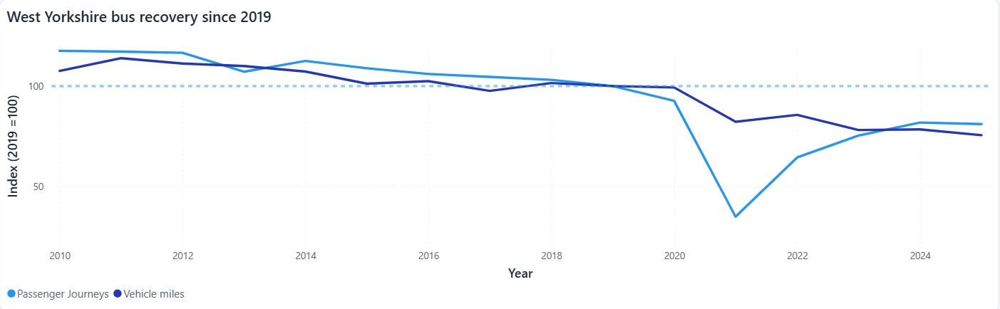
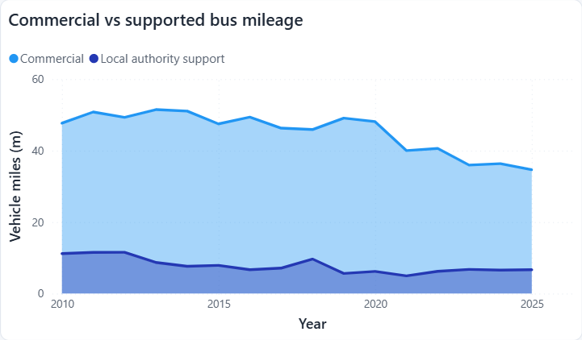
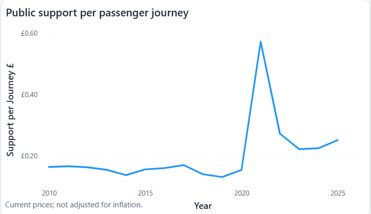
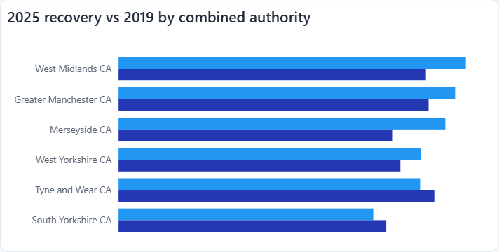
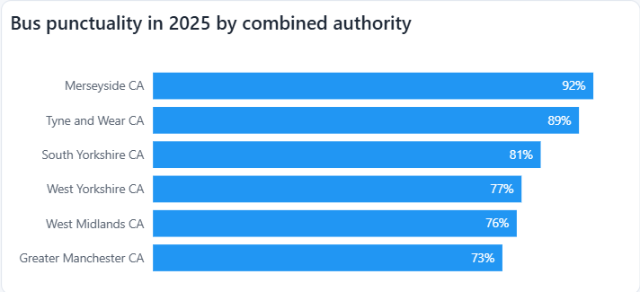
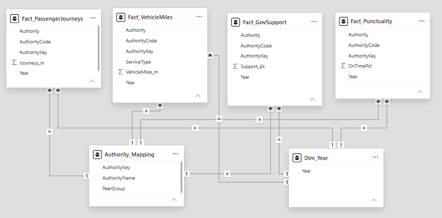

# West Yorkshire Bus Performance

A Power BI analysis of post-pandemic bus recovery in West Yorkshire, built from four
Department for Transport statistical tables and benchmarked against five peer combined
authorities.

**[Open the live report](https://app.powerbi.com/view?r=eyJrIjoiMWI1ZDc5NzQtYzAwZi00Nzk2LThjNTgtMTdiY2ZkN2JlNGMxIiwidCI6IjBkM2I2MTRlLTQ0YzEtNDg3Zi05N2YzLWVmZjhiM2Y5NzE3YiJ9)** ·
three pages, fully interactive.

> Passenger journeys are back to **81.1%** of their 2019 level. Vehicle miles are only at
> **75.5%**. The network contracted faster than demand did, and the mileage that survived
> is increasingly publicly supported.

---

## The question

Has West Yorkshire's bus network recovered since the pandemic, and how have service
provision, public support and reliability changed alongside passenger demand?

Passenger journeys on their own are a thin measure of recovery. If the network carrying
those passengers has shrunk further than the passengers have, "recovery" describes a
smaller thing than it did in 2019. This analysis reads recovery as four things at once:
demand, service supply, funding and reliability.

## Findings

### 1. Demand recovered further than the network did

Journeys sit at 81.1% of the 2019 baseline, vehicle miles at 75.5%. The gap is the
finding. A recovery story told only with passenger numbers looks like a demand problem.
Read against mileage, it looks more like a supply decision.

### 2. The mileage that survived is publicly supported

Commercial mileage is down 29.4% on 2019 while supported mileage is up 18.3%. Supported
services now account for 16.1% of all vehicle miles. The mix has shifted, not just the
total, which makes the future size of the network a funding decision rather than a
commercial one.

### 3. Support per journey has roughly doubled

£0.25 per journey in 2025 against £0.13 in 2019. The 2021 peak is a denominator effect
from near-zero passenger volumes, not a funding surge. Figures are current prices with
no inflation adjustment.

### 4. West Yorkshire ranks fourth of six

Against Greater Manchester, Merseyside, South Yorkshire, Tyne and Wear and the West
Midlands, West Yorkshire is fourth on passenger recovery and fourth on punctuality.
That is below the middle of the group rather than at it.

The peer view also reframes finding 1. A network shrinking faster than demand is a
regional pattern, not a West Yorkshire peculiarity: it appears in four of the six
authorities, and West Yorkshire's gap of 5.6 points is the mildest of those four. In
Tyne and Wear and South Yorkshire the pattern reverses.

### 5. Spending more does not buy punctuality

Merseyside and Greater Manchester both record roughly £0.50 of public support per
journey. Merseyside is the best performer at 92% on time, Greater Manchester the worst
at 73%. Whatever separates them, it is not the amount of recorded support.

See **[docs/support-data-note.md](docs/support-data-note.md)** before reading the
support axis. Two authorities sit at or below zero because of how their net support is
reported, and they are treated as unavailable rather than as low spenders.

## Data

All sources are DfT bus statistics, published under the Open Government Licence, year
ending March 2025.

- **BUS01e** passenger journeys by local authority, 2010 to 2025, into `Fact_PassengerJourneys`
- **BUS02d_mi** vehicle miles by authority and service type, into `Fact_VehicleMiles`
- **BUS05di** estimated net government support in £000s, into `Fact_GovSupport`
- **BUS09a** percentage of non-frequent services running on time, into `Fact_Punctuality`
- **Authority_Mapping.csv** a hand-built peer lookup, into `Authority_Mapping`

## The model

Four fact tables, each filtered by a shared `Dim_Year` and a shared `Authority_Mapping`.
Facts are never joined to one another, so measures over journeys and over support can
sit in the same visual without fanning out.

## The hard part: government tables that do not join

These are published statistical tables, not a clean dataset. Most of the work was making
them joinable.

- **Authority codes are inconsistent between tables.** Tyne and Wear is `E11000007` in
  BUS01 but `E11000004` in BUS09, so a join on code fails silently rather than erroring.
- **Names are inconsistent too.** "Stockton-on-Tees" in one table is "Stockton" in
  another, and BUS09 adds `exc` suffixes throughout.
- **Fix:** a hand-built mapping table linking each source's identifier to one standard
  authority.
- **Footnote markers sit inside data cells.** `[z]`, `[x]`, `[r]` and `[p]` force whole
  columns to text. They are converted to null, never to zero, so that missing values
  cannot pose as real ones.
- **Years are stored across columns** and the ranges differ between tables, so every
  table is unpivoted.
- **Mixed geography levels share one column.** England, regions and authorities sit
  together, so a naive sum double-counts. Rows are filtered by code prefix.
- **Units are held raw.** Support stays in £000s in the model and is converted in DAX,
  so the source values remain auditable.

Every step lives in Power Query, so the report refreshes when DfT publishes new data.

## Measures

- `Total Journeys`, `Total Vehicle Miles`, `Total Support (£m)`
- `Journeys vs 2019 Index` and `Miles vs 2019 Index`, with the baseline year fixed in a
  `VAR` using `REMOVEFILTERS` so the index survives any slicer selection
- `Supported Mileage Share`, a `DIVIDE` returning blank rather than an error when an
  authority is filtered out
- `Support per Journey`, converting £000s to £ and dividing within the same filter context
- `On-Time %` for non-frequent services, held separate from the demand measures

## Limitations

- **Annual and aggregated.** Route-level and operator-level variation is hidden, so this
  cannot say where the contraction fell.
- **Current prices.** Support is not inflation-adjusted, so part of the rise is nominal.
- **Net support.** Offsets, accounting practice and inter-authority transfers all move
  the reported figure. See the data note.
- **Punctuality is a survey.** Methods differ between authorities, there was no survey
  for the year ending March 2020, and the data records lateness without explaining it.
- **A chosen peer group.** Five combined authorities, not every possible comparator.
- **Association, not causation.** Support per journey plotted against punctuality is an
  observation about the group, not a mechanism.

## Next analysis

- A real-terms support measure, to separate nominal from actual change
- Route or operator data, to locate where service was withdrawn
- Population, employment and deprivation overlays, to test who lost service
- Punctuality joined to congestion and roadworks data where it exists

## Repository contents

- `README.md` this file
- `data/raw/` the DfT source workbooks exactly as downloaded
- `data/Authority_Mapping.csv` the hand-built peer lookup
- `docs/support-data-note.md` why two peers report zero or negative net support
- `images/` the report visuals used above, plus the data model
- `West_Yorkshire_Bus_Performance_Report.pptx` the written report

---

Built by January Sambrook

Contains public sector information licensed under the Open Government Licence v3.0.
